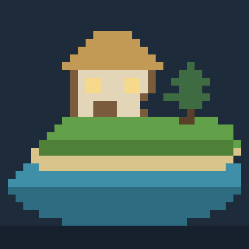

# Pixel Haven

A 2.5D idle life simulator. Pixel-art villagers build and live on a procedurally
generated voxel island while you watch over them. Nothing in it needs you —
which is the point.

Built to be played on an iPad: it runs in Safari, installs to the Home Screen,
and works offline.



## What it is

You are not a manager. Villagers decide for themselves what to chop, what to
plant, who to talk to and when to go to bed, based on their needs, their traits
and what the haven is short of. You can lean on that — mark out a blueprint and
they will haul the materials and raise it, point someone somewhere, spend Favor
on a warm meal — but you can also just leave it running and come back to a
village that grew while you were gone.

- **The island.** 96×96 voxel columns generated from a seed: a warped radial
  coastline, a carved meandering river, beaches, cliffs, and a ridge of
  mountains. Trees, boulders and bushes sit *off* the grid, at their own
  positions, rotations and scales, so a blocky island never reads as graph paper.
- **The villagers.** Two traits each out of eighteen, four needs, real
  friendships, and a utility-scored state machine covering idle, work and
  social behaviour. A Lazy villager still gets it done, with more naps on the way.
- **The seasons.** Spring blossom, summer fireflies, autumn turning the oaks
  orange, snow settling on every upward-facing surface in winter. All of it is
  cosmetic by design: Pixel Haven never punishes you for looking away.
- **The sound.** Entirely synthesised at runtime — a slow generative pentatonic
  pad that never loops, plus wind, surf, birdsong, crickets, fire and village
  chatter that fade up as you push the camera in.

## Playing it on an iPad

**Option 1 — from your computer, over your home Wi-Fi**

```bash
npm install
npm run dev
```

Vite prints a `Network:` address like `http://192.168.1.24:5173`. Open that in
Safari on the iPad. Both devices need to be on the same network.

**Option 2 — deploy it, then add it to the Home Screen**

```bash
npm run build     # outputs a static site to dist/
```

`dist/` is plain static files with relative paths, so it will run on anything
that serves files.

**GitHub Pages** is the setup this repo is wired for.
`.github/workflows/deploy.yml` builds and publishes on every push. Two
one-time settings:

1. **Settings → General → Danger Zone → Change visibility → Make public.**
   Pages is free on public repositories and needs a paid plan on private ones.
2. **Settings → Pages → Source: GitHub Actions.** A workflow's token is not
   allowed to switch this on for you.

The next push then publishes to `https://<user>.github.io/<repo>/`.

If you would rather not make it public:

- **Netlify Drop** (`app.netlify.com/drop`) — drag the `dist` folder or a zip of
  it onto the page. No account, no config, instant URL, but it does not update
  itself when the code changes.
- **Netlify, Vercel or Cloudflare Pages connected to the repo** — all three
  build private repositories on their free tiers, and all three redeploy on
  push. Build command `npm run build`, publish directory `dist`.

Once it is on a URL, open it in Safari and tap **Share → Add to Home Screen**.
It then launches full screen with no browser chrome, keeps its save, and runs
with no network connection.

## Controls

| Gesture | What it does |
| --- | --- |
| One finger, drag | Turn the island |
| Two fingers, pinch | Zoom in and out |
| Two fingers, slide | Pan across the island |
| Two fingers, twist | Spin the view |
| Tap a villager | See who they are and what they are doing |
| Double-tap | Focus and push in on that spot |
| **Build** → a card, then press and slide | Aim a blueprint; lift to place it |
| **Favor** | Spend what the haven's good mood earns you |

On a desktop: left-drag orbits, the scroll wheel zooms, `space` pauses, `1`–`4`
set the speed, `Escape` cancels.

## How it fits together

```
src/
  core/        seeded RNG, Perlin noise, maths, the world clock, an event bus
  world/       the height field, its generation, natural props, A* navigation
  sim/         villagers, traits, the brain, and Haven — the simulation root
  build/       blueprint definitions and the structures they become
  render/      terrain mesher, water, instanced props, buildings, sprites,
               sky and weather, the touch camera, the scene that drives them
  audio/       the whole soundtrack, synthesised
  ui/          HUD, build drawer, inspector, overlays, pixel icons
  state/       save, load, and offline catch-up
```

A few decisions worth knowing about:

- **Terrain is a height field, not a voxel volume.** There are no overhangs, so
  one integer height plus one material per column describes the world exactly.
  The mesher emits one top quad per column and a side quad wherever a neighbour
  sits lower — roughly a tenth of the triangles a full voxel mesher would, which
  is the difference between 60fps and a slideshow on a tablet.
- **Seasons are a shader uniform.** Baking autumn into vertex colours would mean
  re-meshing the island every time the palette shifted. Instead each vertex
  carries a two-component "how much does this surface care about the weather"
  weight, and a whole year passes as a uniform update per frame.
- **The simulation is headless.** `Haven` has no reference to three.js, which is
  why the entire game can be tested in Node, and why offline catch-up can replay
  eight hours in under a second.
- **A save is a seed plus deltas.** The island regenerates from its seed; the
  save file carries the terrain edits, the props villagers felled or planted,
  the buildings and the people. It all fits in localStorage.
- **Nothing is downloaded at runtime.** Every sprite, icon, texture and note of
  music is generated in code. There are no asset files to miss.

## Development

```bash
npm install
npm run dev        # dev server, reachable on your local network
npm run build      # typecheck, then build to dist/
npm run preview    # serve the built site
npm test           # unit and integration tests (Node, no browser)
npm run typecheck
```

Browser smoke test — boots the built game in headless Chromium, plays it, and
fails on any console error, villager lost at sea, or save that does not survive
a reload:

```bash
npm run build
npx playwright install chromium   # once
npm run test:e2e
```

There is a debug handle on `window.pixelHaven` (`.haven`, `.scene`, `.select()`,
`.place()`), which is handy from the Safari inspector and is what the smoke test
drives the game through.

Icons are generated rather than drawn: `node scripts/make-icons.mjs` rewrites
`public/icons/` from a pixel grid in the script.

## Licence

MIT.
